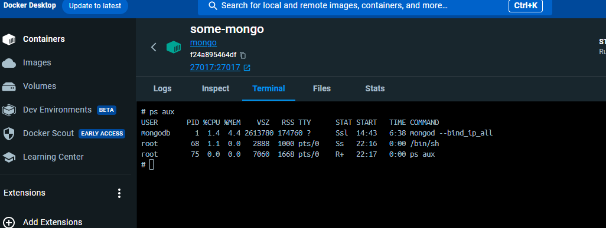
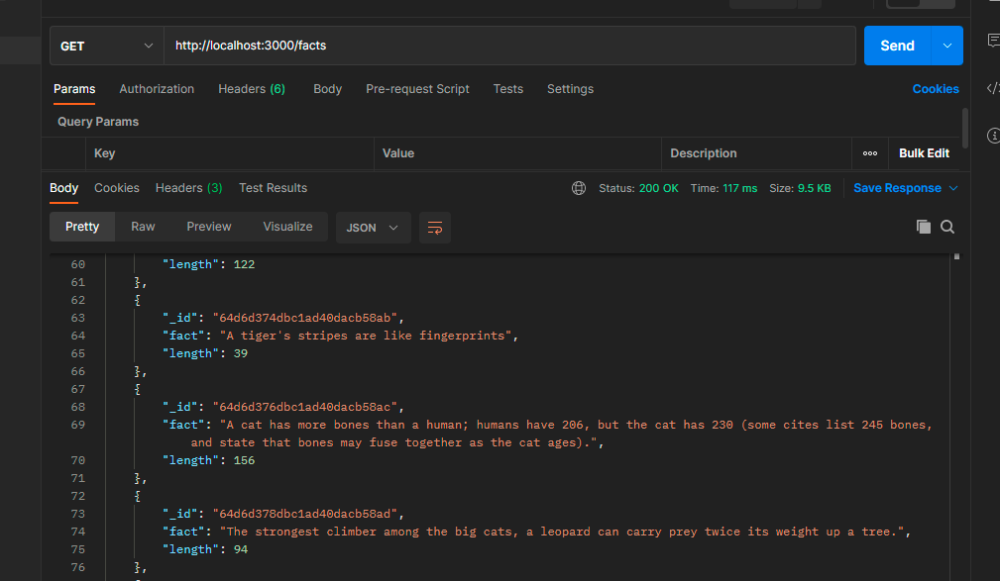

#### The goal of this project is to create a program that fetches random cat facts from an external API, stores them in a MongoDB database, and provides a simple HTTP server to access these facts. 

#### Install mongodb with docker🐟
```
docker run --name some-mongo -p 27017:27017 -d mongo
```


#### Go dependencies
```
go get go.mongodb.org/mongo-driver/mongo
go get go.mongodb.org/mongo-driver/bson
```

#### Mongo Golang quickstart 
```
client, err := mongo.Connect(context.TODO(), options.Client().ApplyURI("mongodb://localhost:27017"))
if err != nil {
    panic(err)
```

#### Run the project
```
go run main.go
```
 
